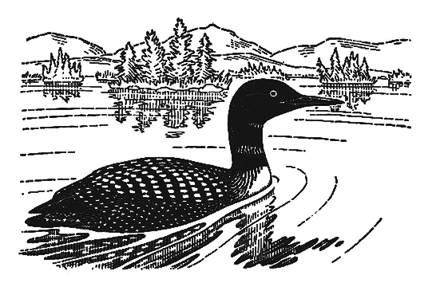

# loon

<p align="center">
  <picture>
    <source media="(prefers-color-scheme: dark)" srcset="web/public/loon-light.png">
    <source media="(prefers-color-scheme: light)" srcset="web/public/loon.png">
    
  </picture>
</p>

A functional language with invisible types, safe ownership, and algebraic effects.

**[Try it in your browser →](https://loonlang.com/play)**

```
[fn greet [name]
  [println "Hello, {name}!"]]

[pipe [range 1 10]
  [filter [fn [n] [> n 4]]]
  [map [fn [n] [* n n]]]
  [each println]]
```

## Features

- **Type Inference** — Full Hindley-Milner with let-polymorphism and row types. No annotations required.
- **Ownership** — Rust-style move semantics and borrow checking, inferred from dataflow. No lifetimes.
- **Algebraic Effects** — Declare, perform, and handle effects. Replaces exceptions, async, and mutable state.
- **Pattern Matching** — Positional pairs with destructuring and expression guards.
- **Type Methods** — Define methods inside `type` declarations with automatic dispatch.
- **Macros** — Template macros with quasiquoting. Procedural macros with compile-time IO.
- **Pipes** — Thread data through transformation chains. No nesting, no temp variables.
- **Language Server** — Diagnostics, hover types, go-to-definition, completions, inlay hints.
- **WASM** — Compiles to WebAssembly with closures, ADTs, and tree-shaking.

## Quick Start

```bash
curl -fsSL https://loonlang.com/install.sh | sh
```

```bash
loon run hello.oo        # Run a program
loon repl                  # Interactive REPL with time-travel
loon fmt hello.oo        # Format source
loon explain E0201         # Interactive error tutorial
```

## Architecture

```
loon/
├── crates/
│   ├── loon-lang/        # Core: parser, type checker, interpreter
│   ├── loon-cli/         # CLI: run, repl, fmt, explain
│   ├── loon-lsp/         # Language server protocol
│   └── loon-wasm/        # WASM bindings for browser
├── web/                  # Website (written in Loon)
│   ├── public/           # Static assets, WASM bootstrap
│   └── src/              # Loon source: pages, components, router
├── tree-sitter-loon/     # Tree-sitter grammar
├── samples/              # Example programs
└── tests/                # Test suite
```

## Development

```bash
# Run tests
cargo test --workspace

# Build WASM + dev server
cd web && npm run dev

# Build language server
cargo build -p loon-lsp --release
```

## License

[MIT](LICENSE)
